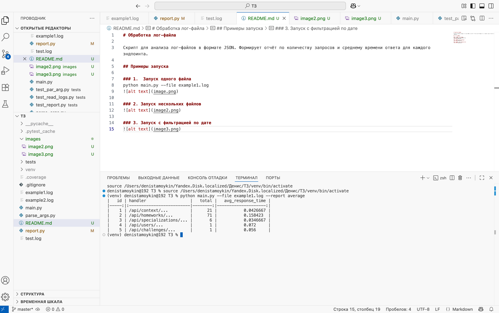
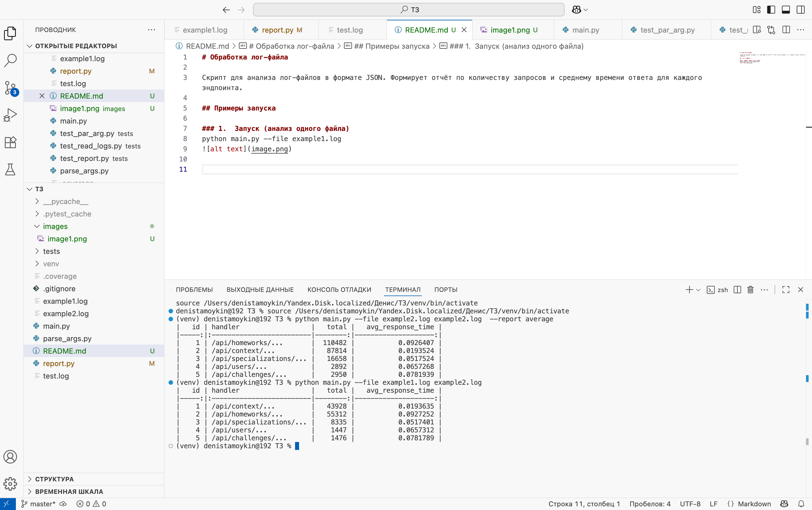
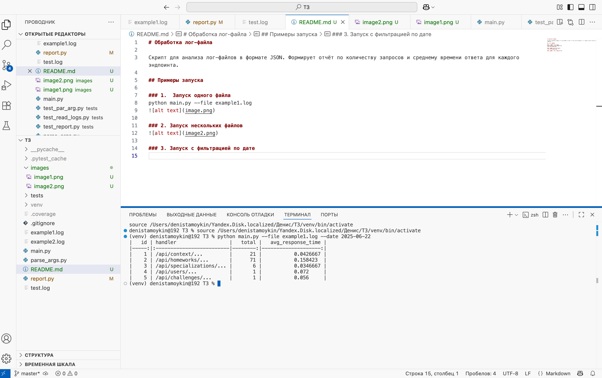
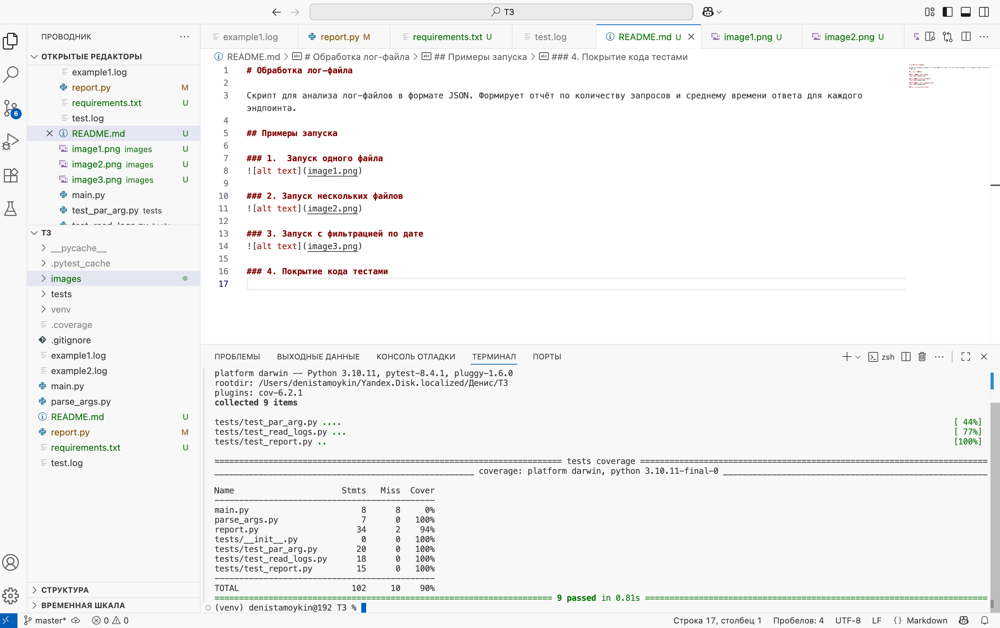

# Обработка лог-файла

Скрипт для анализа лог-файлов в формате JSON. Формирует отчёт по количеству запросов и среднему времени ответа для каждого эндпоинта.

## Примеры запуска

### 1.  Запуск одного файла

### 2. Запуск нескольких файлов

### 3. Запуск с фильтрацией по дате (Дополнительное задание)

### 4. Покрытие кода тестами (90%)
